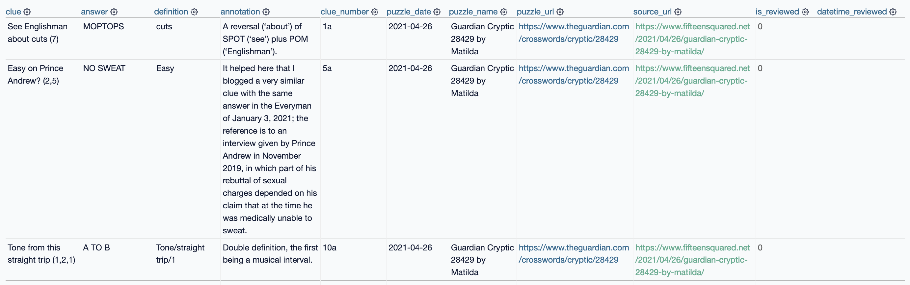

# `cryptics.eigenfoo.xyz`

> A Python library to scrape three cryptic crossword blogs and parse the scraped
> blog posts into a structured dataset of cryptic crossword clues. The three
> blogs are [http://bigdave44.com/](http://bigdave44.com/),
> [https://www.fifteensquared.net/](https://www.fifteensquared.net/) and
> [https://times-xwd-times.livejournal.com/](https://times-xwd-times.livejournal.com/).

The resulting structured dataset looks something like this:

---

## License

This dataset is made available under the [Open Database
License](http://opendatacommons.org/licenses/odbl/1.0/). A human-readable
summary is [available
here](https://opendatacommons.org/licenses/odbl/summary/). Any rights in
individual contents of the database are licensed under the [Database Contents
License](http://opendatacommons.org/licenses/dbcl/1.0/).

HTML and CSS code was modified from
[`pandoc-markdown-css-theme`](https://github.com/jez/pandoc-markdown-css-theme),
which is licensed under the [Blue Oak Model
License](https://blueoakcouncil.org/license/1.0.0). The remainder of the code
is licensed under the [MIT License](https://mit-license.org/).

---

## Colophon

- Data published using [Datasette](https://datasette.io/) and deployed with [Heroku](https://dashboard.heroku.com/apps)
- Documentation template adapted from [`pandoc-markdown-css-theme`](https://github.com/jez/pandoc-markdown-css-theme)
